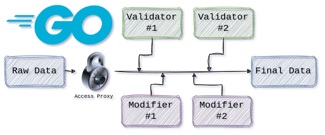

# Golang: Ensuring Data Integrity with Access Proxies

This repo contains a demo example for the [first part of my `Access Proxies in Go` blog series](https://itnext.io/golang-ensuring-data-integrity-with-access-proxies-eb60a2453f3c)

## Introduction:
Dealing with an ever changing data can be tough. Especially when you're trying to keep track of the original values at a given time. Let me explain:

Imagine a user is trying to submit a form which he filled with his desired inputs. Before finalizing the submit process and saving the data in a database, we want to either make sure about the validity of the inputted data or make certain modifications on it.

Let's say we have 4 independent pieces of code (agents), 2 of which validates the data while the other 2 make modifications. Having that each agent is independent from the others, agents are required to see the original input data without any modifications (think of Isolation in databases, one of the ACID properties. We don't want any dirty reads, lost updates or similar problems. Serializability is the desired behavior in our case).

Whether or not we decide to run the agents concurrently, we have to make sure of the following:
- Each agent acts on the original data
- Since agents are independent, the order in which they modify or validate the data should not effect the final outcome. Meaning that we need to implement a way to capture the changes that each agent make to the original data and (probably) throw an error in case of any overlapping changes (since this would simply cause lost updates. Original → Change #1 → Change #2 (final) vs Original → Change #2 → Change #1 (final) hence non-identical outcomes)

In order to satisfy the first criteria, we have the obvious option to pass a copy of the original data to each agent, but is it scalable? Probably not. The memory overhead has a linear correlation with both the size of the input data and the number of agents, so it basically increases exponentially. So we're required to utilize pointers in order to prevent unnecessary allocations. We've spoken about pointers and their dangerous nature in a previous blog, so when dealing with them, we can't be too cautious. Here comes the Access Proxy.

If you enjoyed this blog post, consider a clap and sharing it with the ones you care about. You can also find me on [LinkedIn](https://www.linkedin.com/in/homayoon-alimohammadi), [Twitter](https://twitter.com/HomayoonAlm) and my [Website](https://homayoon.blog).
